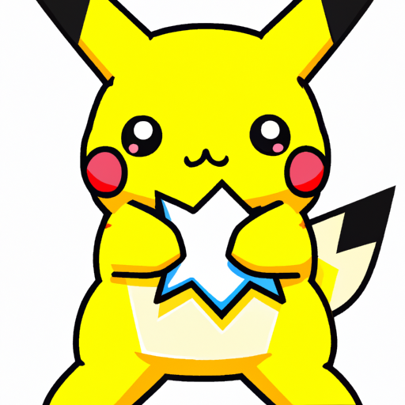

# OpenAI Image Generator

This is a simple image generator built with Node.js and Express that uses [OpenAI's Dall-E models](https://beta.openai.com/docs/guides/images) to generate images.



## Usage


Generate an API KEY at [OpenAI](https://beta.openai.com/) and add it to the `.env` file.

Install the dependencies

```bash
npm install
```

Run server

```bash
npm start
```

Visit `http://localhost:5000` in your browser.

`POST http://localhost:5000/openai/generateimage`. To generate an image.
`POST http://localhost:5000/openai/generatevariation`. To generate variations of an image.
`POST http://localhost:5000/openai/generateedition`. To edit an image.